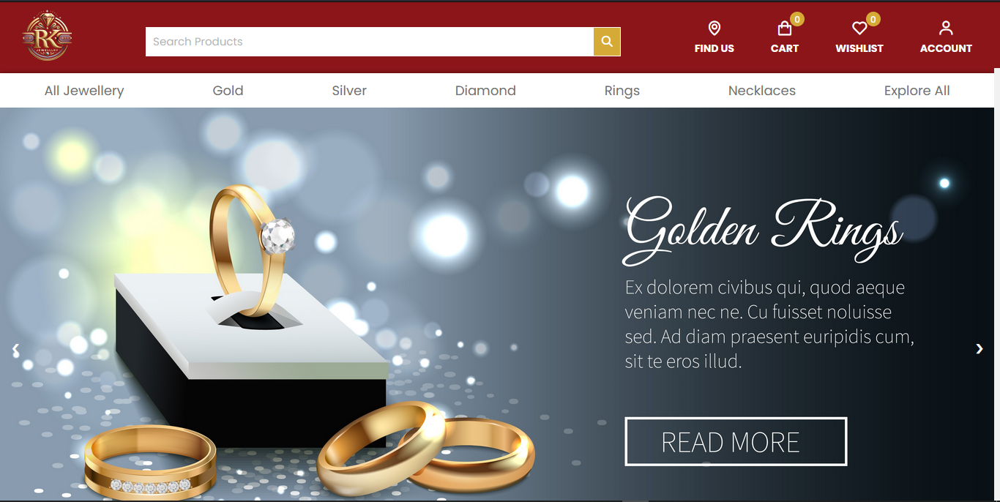
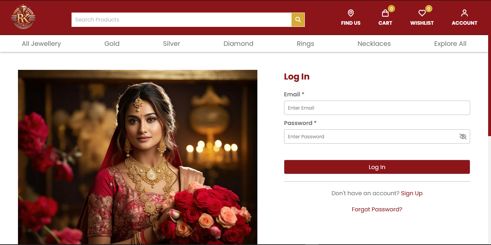
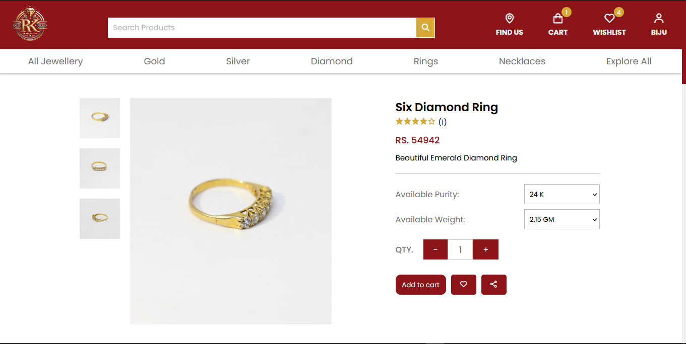
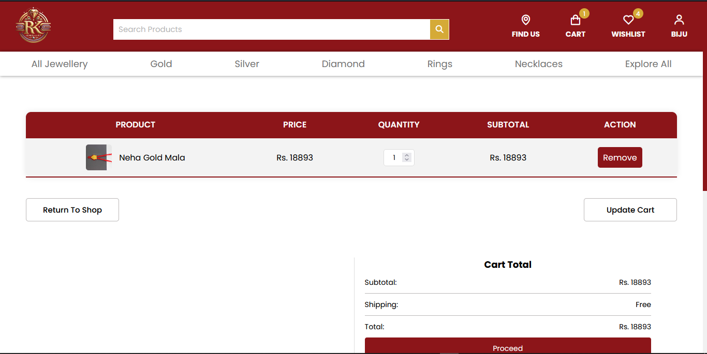
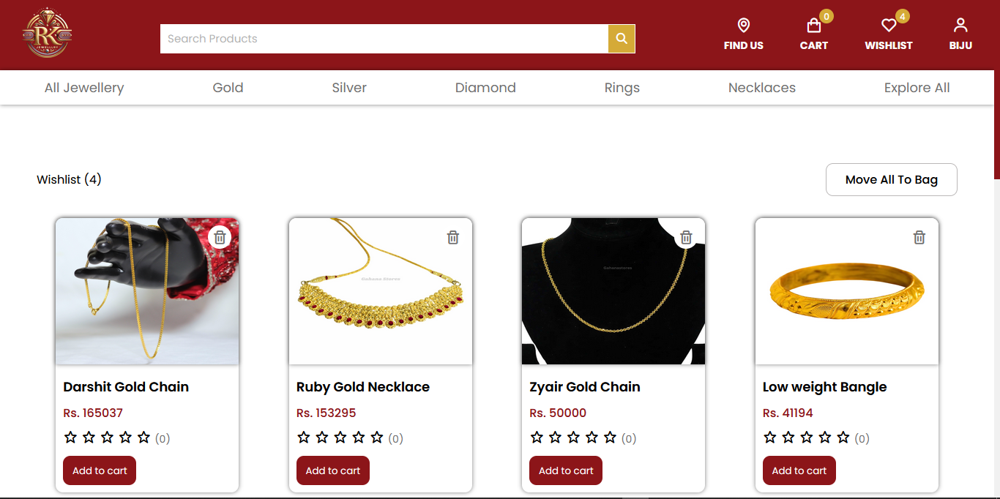
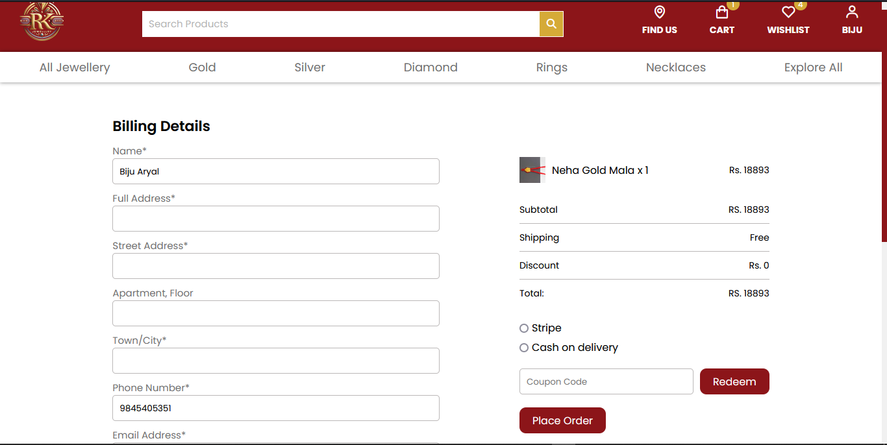

# Online Jewelry Store

This project is a full-featured e-commerce website tailored for online jewelry sales. It provides an elegant and user-friendly interface, allowing customers to browse, select, and purchase jewelry items with ease.

---

## Table of Contents

- [Features](#features)
- [Screenshots](#screenshots)
- [Tech Stack](#tech-stack)
- [Installation](#installation)
- [Usage](#usage)
- [Contributing](#contributing)
- [License](#license)

---

## Features

- **Product Catalog**: Browse a wide selection of jewelry items, including rings, necklaces, earrings, and more.
- **Product Details**: Each item includes detailed descriptions, high-quality images, and customer reviews.
- **User Authentication**: Secure sign-up, login, and account management.
- **Shopping Cart**: Easily add, update, or remove items from the cart.
- **Wishlist**: Save favorite items to a personal wishlist for future purchases.
- **Checkout and Payment**: A streamlined checkout process, including payment gateway integration.
- **Order Tracking**: Users can track their order status from purchase to delivery.
- **Admin Panel**: Product, category, and order management for administrators.
- **Responsive Design**: Optimized for mobile, tablet, and desktop views.

---

## Screenshots

### Home Page


### Login Page


### Product Detail


### Shopping Cart


### Wishlist


### Billing


---

## Tech Stack

- **Frontend**: HTML, CSS, JavaScript, Bootstrap
- **Backend**: PHP
- **Database**: MySQL
- **Payment Integration**: PayPal / Stripe
- **Deployment**: Apache/Nginx server

---

## Installation

### Prerequisites
- PHP >= 7.4
- MySQL
- Apache or Nginx web server

### Steps

1. **Clone the Repository**

   ```bash
   git clone https://github.com/bijuaryal91/Ecommerce.git
   cd Ecommerce

2. **Database Setup**
- Import the SQL file located at DB/rk_db.sql into your MySQL database.
- Update database connection details in includes/connection.php and admin/php/connection.php
3. **Start Server**
- Set up the project on your local server (e.g., using XAMPP or WAMP) and access it at http://localhost/Ecommerce.

## Usage
1. **Browse Products**: Access the home page to explore jewelry items.
2. **Sign Up / Log In**: Register for an account to save items to a wishlist, place orders, and track purchases.
3. **Add to Cart**: Select jewelry pieces and add them to your shopping cart.
4. **Checkout**: Complete the checkout process with shipping and payment details.
5. **Track Orders**: Use the account section to track current and past orders.

## Contributing
1. Fork the repository
2. Create a new branch (git checkout -b feature-name)
3. Commit changes (git commit -m "Add new feature")
4. Push to the branch (git push origin feature-name)
5. Open a Pull Request

## License
This project is licensed under the MIT [License](LICENSE). See the LICENSE file for more details.